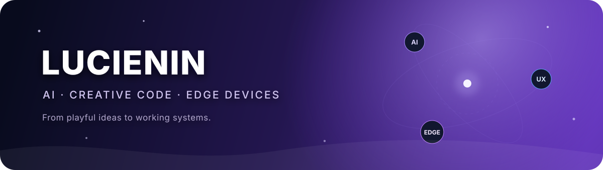

<!-- github-profile-readme -->

<p align="center">
  
</p>

<p align="center">
  <a href="https://github.com/LUCIENIN?tab=repositories">
    
  </a>
  
</p>

<p align="center">
  <a href="https://git.io/typing-svg">
    
  </a>
</p>

## Hi, I'm LUCIENIN 👋

我喜欢把想法做成真正能运行的产品：从 AI 自动化工具、摄像头手势交互，到 RK3568 边缘设备。

- 🧠 **AI automation** — 让智能工具可以持续、可靠地完成真实任务
- ✨ **Creative coding** — 用视觉、动作和生成式体验创造更有生命力的界面
- ⚙️ **Edge devices** — 把视觉识别与本地计算带到真实硬件

## Latest public builds

<sub>Automatically refreshed from my latest public, non-fork repositories.</sub>

<!-- AUTO-PROJECTS:START -->
| Project | Description | Activity |
| --- | --- | --- |
| [workspace-redaction-app](https://github.com/LUCIENIN/workspace-redaction-app) | Privacy router, content-free snapshot, and publication workflow for a local LLM Wiki knowledge base | `Python` · ⭐ 0 · Updated 2026-08-27 |
| [pixel-cover-from-zero](https://github.com/LUCIENIN/pixel-cover-from-zero) | A reusable, evidence-backed workflow and prompt for pixel-style social covers. | `Other` · ⭐ 0 · Updated 2026-08-20 |
| [e01-codex-ring](https://github.com/LUCIENIN/e01-codex-ring) | Experimental macOS Swift toolkit for E01/ZRun round BLE badges and a Codex allowance dashboard | `Swift` · ⭐ 0 · Updated 2026-08-20 |
| [ai-creator-ops-playbook](https://github.com/LUCIENIN/ai-creator-ops-playbook) | Human-centered, evidence-first AI writing system for natural language, visual content, localization, and verified publishing — 中文 / English / Русский. | `Other` · ⭐ 0 · Updated 2026-08-17 |
| [android-sister](https://github.com/LUCIENIN/android-sister) | 本地优先的 macOS Android 真机伴侣：ADB 设备发现、应用级投屏与 Android 14+ Fusion 虚拟显示。 | `Swift` · ⭐ 1 · Updated 2026-08-02 |
| [vision-lock-rk3568](https://github.com/LUCIENIN/vision-lock-rk3568) | RK3568智能锁屏系统 - 人脸检测+欢迎词+天气+新闻+汇率+运势 | `Python` · ⭐ 0 · Updated 2026-08-02 |
<!-- AUTO-PROJECTS:END -->

## Toolbox

<p align="center">
  <a href="https://skillicons.dev">
    
  </a>
</p>

## How I build

```text
interesting idea → smallest working version → real-world verification → reliable product
```

I care about local-first design, clear failure boundaries, reproducible tests and technology that survives outside a demo.

## GitHub activity

<p align="center">
  
  
</p>

<picture>
  <source
    media="(prefers-color-scheme: dark)"
    srcset="https://raw.githubusercontent.com/LUCIENIN/LUCIENIN/output/github-contribution-grid-snake-dark.svg"
  />
  <source
    media="(prefers-color-scheme: light)"
    srcset="https://raw.githubusercontent.com/LUCIENIN/LUCIENIN/output/github-contribution-grid-snake.svg"
  />
  
</picture>

<p align="center">
  <sub>Build curious things. Make them real. Keep them reliable.</sub>
</p>
